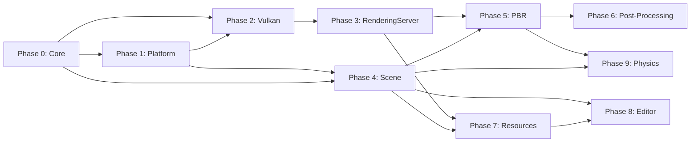

# Rover 游戏引擎完整开发路线图

## 架构总览

```mermaid
graph TD
  subgraph sceneLayer [Scene Layer]
    SceneTree["SceneTree : MainLoop"]
    Node["Node / Node3D / MeshInstance3D ..."]
  end

  subgraph serverLayer [Server Layer]
    RenderingServer["RenderingServer"]
    DisplayServer["DisplayServer"]
    PhysicsServer["PhysicsServer"]
    AudioServer["AudioServer"]
  end

  subgraph driverLayer [Driver Layer]
    RenderingDevice["RenderingDevice (Vulkan)"]
    VulkanDriver["VulkanDriver (volk + VMA)"]
  end

  subgraph platformLayer [Platform Layer]
    SDL3["SDL3 (Window / Input / Events)"]
  end

  subgraph coreLayer [Core Infrastructure]
    Object["Object + ClassDB + Variant"]
    Signals["Signal System"]
    EventBus["EventBus (Realm)"]
    Scheduler["Scheduler (Realm)"]
    Memory["Memory / StringName / Logger"]
  end

  SceneTree --> Node
  Node --> RenderingServer
  Node --> PhysicsServer
  SceneTree --> Scheduler

  RenderingServer --> RenderingDevice
  DisplayServer --> SDL3
  RenderingDevice --> VulkanDriver

  sceneLayer --> serverLayer
  serverLayer --> driverLayer
  driverLayer --> platformLayer
  serverLayer --> coreLayer
  sceneLayer --> coreLayer
end
```


## 现有基础

Rover 已具备完整的 CMake 构建骨架，模块划分为 `core/`、`main/`、`platform/`、`scene/`、`servers/`，第三方依赖（SDL3, GLM, VMA, ImGui, spdlog, EnTT, volk）已通过 git submodule 集成。C++20 标准，支持 Linux 和 Windows 双平台构建。

**注意：** 当前选择 Node 树作为场景模型，EnTT 依赖保留但不作为核心场景系统，可供后续数据密集型子系统（如粒子、批量物理查询）按需使用。

---

## Phase 0: Core Infrastructure

**目标：** 搭建所有上层系统依赖的基础设施。

### 0.1 类型与内存基础

- `core/typedefs.h` -- 基础类型别名（`real_t`, `uint32_t` 等）
- `core/memory/` -- 自定义分配器接口、对齐分配工具
- `core/string/string_name.h` -- 字符串驻留（interning），用于高效比较（参考 Godot `core/string/string_name.h`）

### 0.2 Object 反射系统

- `core/object/object.h` -- `Object` 基类，RTTI 支持，`_notification()` 虚函数
- `core/object/class_db.h` -- `ClassDB` 类注册表，存储 `ClassInfo`（创建函数、方法映射、属性映射、信号列表）
- 注册宏：`ROVER_CLASS(ClassName, ParentClass)` 展开为静态注册函数和 `get_class_static()` 等
- `ClassDB::register_class<T>()`、`ClassDB::instantiate(StringName)`

### 0.3 Variant 系统（简化版）

- `core/variant/variant.h` -- 统一值容器，支持：NIL, BOOL, INT, FLOAT, STRING, VECTOR2/3/4, COLOR, OBJECT, ARRAY, DICTIONARY
- 不需要 Godot 那样 40+ 种类型，保持精简
- 提供类型转换、比较、哈希

### 0.4 Signal 系统

- `core/object/signal.h` -- 基于 `Callable`（对象指针 + 方法名）的信号连接
- `Object::connect(signal_name, target, method)`、`Object::emit_signal(signal_name, args...)`
- 信号在 ClassDB 中注册，编辑器可发现

### 0.5 EventBus（来自 Realm）

- `core/event/event_bus.h` -- 类型擦除的发布/订阅系统
- 基于 `std::type_index` 路由，`subscribe<T>(callback)`、`publish<T>(event)`
- 用于子系统间解耦通信（如窗口 resize 通知渲染系统）

### 0.6 日志系统

- `core/log/logger.h` -- 封装 spdlog，提供 `LOG_INFO`、`LOG_WARN`、`LOG_ERROR` 等宏
- 支持多 sink（控制台 + 文件）

### 0.7 数学适配

- `core/math/` -- 封装 GLM，提供 `Vector2/3/4`、`Matrix4`、`Quaternion`、`Transform3D`、`AABB`、`Plane` 等
- 定义 Vulkan 坐标系约定（右手系，Y 向上，depth [0, 1]）

---

## Phase 1: Platform & Main Loop

**目标：** 窗口创建、输入处理、引擎主循环。

### 1.1 DisplayServer

- `servers/display/display_server.h` -- 抽象接口：窗口创建/销毁、事件轮询、标题/大小设置
- `platform/sdl3/display_server_sdl3.h` -- SDL3 实现
- 工厂注册模式（参考 Godot `DisplayServer::register_create_function()`）

### 1.2 Input 系统

- `core/input/input.h` -- `Input` 单例：按键状态查询、鼠标位置、动作映射
- `core/input/input_event.h` -- `InputEvent` 层级：`InputEventKey`、`InputEventMouseButton`、`InputEventMouseMotion`
- SDL3 事件转换为 InputEvent，通过 SceneTree 分发

### 1.3 Engine & Main Loop

- `core/engine.h` -- `Engine` 单例：帧率控制、时间步长、版本信息
- `main/main.cpp` -- 入口点：`Main::setup()` -> `Main::start()` -> `OS::run()` -> `Main::iteration()`
- 主循环结构参考 Godot：
  1. Input 轮询
  2. 物理步进（固定时间步，可多次）
  3. Process（逻辑更新）
  4. Render（同步 + 绘制）

### 1.4 Scheduler（来自 Realm）

- `core/sched/scheduler.h` -- 按 `SystemPhase` 注册和执行系统
- 阶段：`PrePhysics` -> `Physics` -> `PostPhysics` -> `PreProcess` -> `Process` -> `PostProcess` -> `PreRender` -> `Render` -> `PostRender`
- 在 `Main::iteration()` 中按阶段驱动 Scheduler

---

## Phase 2: Vulkan Rendering Foundation

**目标：** Vulkan 初始化，能渲染一个三角形。

### 2.1 RenderingDevice 抽象

- `servers/rendering/rendering_device.h` -- 低级图形 API 抽象
- 资源创建：Buffer、Texture、Shader、Pipeline、Framebuffer、Sampler
- 命令提交：`draw_list_begin/draw/end`、`compute_list_begin/dispatch/end`
- 同步：Fence、Semaphore
- 采用 RID 句柄管理资源生命周期

### 2.2 Vulkan 后端

- `drivers/vulkan/` 目录：
  - `vulkan_context.h` -- Instance、PhysicalDevice、LogicalDevice、Queue 管理（通过 volk 加载）
  - `vulkan_swapchain.h` -- Swapchain 创建与重建
  - `rendering_device_vulkan.h` -- `RenderingDevice` 的 Vulkan 实现
  - VMA 用于 GPU 内存分配
- SDL3 提供 Vulkan Surface 创建

### 2.3 Shader 编译

- GLSL -> SPIR-V 编译流程（离线，通过 glslangValidator 或 shaderc）
- `servers/rendering/shader/` -- Shader 缓存、反射信息提取

### 2.4 三角形渲染验证

- 最小化的渲染管线：顶点着色器 + 片段着色器 -> 三角形
- 验证完整链路：窗口 -> Vulkan 初始化 -> Swapchain -> Renderpass -> 绘制 -> 呈现

---

## Phase 3: RenderingServer & 渲染管线

**目标：** 高级渲染 API、网格/材质/相机的管理。

### 3.1 RenderingServer

- `servers/rendering/rendering_server.h` -- 高级渲染 API 单例
- RID-based 资源管理：Mesh、Material、Texture、Light、Camera、Viewport、Environment
- 双缓冲命令队列（渲染线程 + 逻辑线程分离预留）
- 每帧 `sync()` + `draw()`

### 3.2 Viewport 系统

- `servers/rendering/renderer_viewport.h` -- Viewport 管理，处理 resize、MSAA、HDR 格式
- 支持多 Viewport（编辑器 + 游戏视口）

### 3.3 基础材质系统

- `servers/rendering/material/` -- `ShaderMaterial`、`StandardMaterial3D`（PBR）
- Uniform 管理、Descriptor Set 布局
- 纹理绑定（Albedo、Normal、Metallic、Roughness、AO）

### 3.4 Mesh 系统

- `servers/rendering/mesh/` -- 顶点格式定义、Mesh 资源
- 支持索引绘制、多 Surface（子网格）
- 基础几何体生成（Box、Sphere、Plane）

### 3.5 Forward 渲染管线

- `servers/rendering/renderer_scene_render_forward.h`
- 深度预通道（可选） -> 不透明 Pass -> 透明 Pass
- 相机与视锥裁剪

---

## Phase 4: Scene System

**目标：** Node 树、场景管理、常用节点类型。

### 4.1 Node 基类

- `scene/main/node.h` -- `Node : Object`
- 父子关系、`NodePath`
- 虚函数：`_ready()`、`_process(delta)`、`_physics_process(delta)`、`_enter_tree()`、`_exit_tree()`
- 通知系统：`_notification(what)`
- ProcessMode（Inherit、Pausable、WhenPaused、Always、Disabled）

### 4.2 SceneTree

- `scene/main/scene_tree.h` -- `SceneTree : MainLoop`
- 管理根节点、节点组、暂停
- 驱动 `_process` / `_physics_process` 调用
- 场景切换：`change_scene(packed_scene)`
- 输入事件通过 `_input()` / `_unhandled_input()` 分发

### 4.3 3D 节点

- `Node3D` -- Transform3D、可见性、层级变换传播
- `Camera3D` -- 投影（透视/正交）、视锥
- `MeshInstance3D` -- 关联 Mesh + Material，向 RenderingServer 提交
- `DirectionalLight3D`、`PointLight3D`、`SpotLight3D`

### 4.4 场景序列化

- `scene/resources/packed_scene.h` -- `PackedScene` + `SceneState`
- 节点树序列化/反序列化
- 场景实例化：`packed_scene->instantiate()`

---

## Phase 5: Lighting & PBR

**目标：** 完整的 PBR 光照管线。

- 方向光 + 点光 + 聚光源
- CSM 阴影（方向光，2-4 级联）
- 点光阴影（Cubemap）
- 聚光阴影
- Cook-Torrance BRDF（GGX + Schlick Fresnel + Smith GGX）
- IBL：HDR -> Cubemap -> 漫反射辐照度 + 预滤波镜面反射 + BRDF LUT
- Skybox 渲染
- 光照数据通过 SSBO/UBO 批量传递

---

## Phase 6: Post-Processing & Advanced Rendering

- GTAO / SSAO（屏幕空间环境光遮蔽）
- Bloom（降采样-升采样链）
- Tonemapping（ACES / Filmic）
- FXAA / TAA
- SSR（屏幕空间反射，可选）
- Deferred 渲染路径（G-Buffer pass -> 光照 pass，作为可选模式）

---

## Phase 7: Resource & Asset Pipeline

- `ResourceLoader` / `ResourceSaver` -- 资源加载/保存框架
- 资源引用计数（`Ref<T>` 智能指针，参考 Godot `RefCounted`）
- glTF 2.0 导入
- 纹理压缩与格式转换
- Shader 预编译与缓存

---

## Phase 8: Editor（ImGui）

- ImGui 集成（已有 SDL3 + Vulkan 后端依赖）
- 场景层级面板（Node 树可视化）
- Inspector 面板（通过 ClassDB 反射自动生成属性编辑器）
- Viewport 渲染（离屏渲染到 ImGui 纹理）
- 资源浏览器
- 控制台 / 日志面板

---

## Phase 9: Physics & Audio

- Physics：Jolt 物理引擎集成，PhysicsServer3D 抽象
- 碰撞体节点：`CollisionShape3D`、`RigidBody3D`、`StaticBody3D`、`CharacterBody3D`
- Audio：AudioServer，基础空间音频

---

## 开发优先级与依赖关系




## 第一步实施

立即开始 **Phase 0**，从 `core/` 模块入手，依次实现类型定义、日志系统、StringName、Object/ClassDB、Variant（简化版）、Signal、EventBus、Scheduler。这些是所有上层系统的基石。