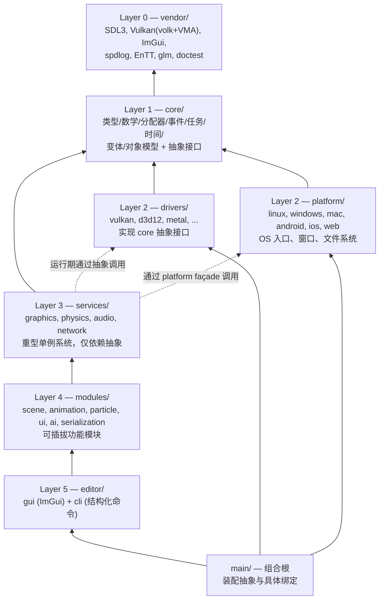
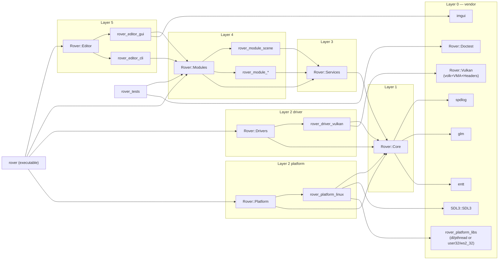

# Rover 引擎架构设计文档

> 本文件是 Rover 引擎的架构权威文档，供后续开发参考。所有结构性变更都应该先更新此文档，再修改代码。

---

## 1. 设计哲学

Rover 借鉴 Godot 的 **核心-服务-驱动** 三段式分层、Unity 的 **模块即特性插件** 思想，再叠加自身特色：

1. **依赖倒置 (Dependency Inversion)** —— `core` 定义抽象接口，`drivers` 实现接口，`services` 仅依赖抽象。具体绑定在 `main/` 完成。
2. **场景即模块** —— 不像 Godot 把 `scene/` 作为固定层，Rover 把场景管理放进 `modules/scene/`，允许 ECS（EnTT）与传统场景树共存或互相替换。
3. **双编辑器接口** —— `editor/gui/` 给人类用 ImGui 操作；`editor/cli/` 给 AI Agent 和脚本提供结构化命令。两者共享同一套编辑器基础设施。
4. **以 CMake 为单一构建源** —— 不引入 SCons / Bee 等额外构建系统，所有目标都通过 CMake 装配。

---

## 2. 分层架构



层级编号意味着 **依赖方向**：编号越低依赖越少。任意层只能依赖编号更低的层（vendor 除外，编号 0 但不依赖任何 Rover 代码）。

### 2.1 各层职责速查表

| 层 | 职责 | 不该做什么 |
|---|---|---|
| **vendor** | 引入第三方库，封装为 CMake target | 不放任何 Rover 业务代码 |
| **core** | 类型系统、数学、内存、事件、任务、变体、对象模型，**声明** `GraphicsDevice` 等抽象接口 | 不直接调用 Vulkan / SDL，不依赖 services / drivers |
| **drivers** | 实现 core 声明的设备抽象（GraphicsDevice 等） | 不调用 services，不感知场景 / 模块 |
| **platform** | 提供 OS 级入口、窗口、文件系统、时间源；通过 SDL3 抹平差异 | 不关心渲染细节 |
| **services** | 渲染、物理、音频、网络等重型单例系统；调用 core 的抽象接口 | 不直接 include 任何 driver 头文件 |
| **modules** | 场景、动画、粒子、UI、AI、序列化等可独立启停的功能 | 不应互相紧耦合（除非 `config.cmake` 显式声明依赖） |
| **editor** | 视觉编辑器 (gui) 与命令行编辑器 (cli) | 仅在 `ROVER_EDITOR=ON` 时构建 |
| **main** | `register_*_types()` 顺序调用、主循环驱动；**唯一**装配具体绑定的位置 | 不实现业务逻辑 |

---

## 3. 目录结构

```
Rover/
├── core/                       Layer 1
│   ├── allocator/              线性 / 池 / 栈 / Arena 分配器
│   ├── event/                  事件总线、信号槽、Delegate
│   ├── math/                   向量、矩阵、四元数、AABB、变换
│   ├── object/                 Object、ClassDB、反射
│   ├── task/                   Job system、Task graph、协程原语
│   ├── time/                   时钟、计时器、Δt、时间戳
│   ├── variant/                Variant 类型系统、Callable
│   ├── register_core_types.{h,cpp}
│   ├── typedefs.h
│   └── CMakeLists.txt          → rover_core (STATIC) / Rover::Core
│
├── drivers/                    Layer 2
│   ├── vulkan/                 Vulkan 后端
│   │   ├── register_types.{h,cpp}
│   │   └── CMakeLists.txt      → rover_driver_vulkan
│   ├── d3d12/                  (future)
│   ├── metal/                  (future)
│   ├── register_driver_types.{h,cpp}
│   └── CMakeLists.txt          → rover_drivers / Rover::Drivers
│
├── platform/                   Layer 2
│   ├── linux/                  X11 / Wayland，主入口
│   ├── windows/                Win32 (stub)
│   ├── mac/                    Cocoa (stub)
│   ├── android/                NativeActivity (stub)
│   ├── ios/                    UIApplicationMain (stub)
│   ├── web/                    Emscripten (stub)
│   ├── register_platform_apis.{h,cpp}
│   └── CMakeLists.txt          → rover_platform / Rover::Platform
│
├── services/                   Layer 3
│   ├── graphics/               GraphicsService、场景渲染、材质
│   ├── physics/                PhysicsService、碰撞、刚体
│   ├── audio/                  AudioService、混音、空间音频
│   ├── network/                NetworkService、传输、复制、RPC
│   ├── register_service_types.{h,cpp}
│   └── CMakeLists.txt          → rover_services / Rover::Services
│
├── modules/                    Layer 4
│   ├── scene/                  EnTT 世界、场景树
│   ├── animation/              骨骼动画、混合树、状态机
│   ├── particle/               GPU/CPU 粒子系统
│   ├── ui/                     UI 框架 (布局、控件、主题)
│   ├── ai/                     导航、行为树、黑板
│   ├── serialization/          资源格式、Asset 导入导出
│   ├── register_module_types.h
│   └── CMakeLists.txt          → rover_modules / Rover::Modules
│
├── editor/                     Layer 5
│   ├── gui/                    ImGui 视觉编辑器
│   ├── cli/                    结构化命令行 (AI 友好)
│   ├── register_editor_types.{h,cpp}
│   └── CMakeLists.txt          → rover_editor / Rover::Editor
│
├── main/
│   ├── main.cpp                组合根
│   └── CMakeLists.txt          → rover (EXECUTABLE)
│
├── tests/
│   ├── main.cpp                doctest 入口
│   └── CMakeLists.txt          → rover_tests (EXECUTABLE)
│
├── docs/                       本文档
├── vendor/                     第三方库（不修改）
├── misc/cmake/                 构建支持
│   ├── RoverOptions.cmake      所有可配置开关
│   ├── RoverCompiler.cmake     编译器旗标 + Sanitizer
│   ├── RoverUtils.cmake        辅助函数
│   └── RoverVersion.h.in       版本头模板
│
├── CMakeLists.txt              根工程
├── .clangd / .clang-format / .clang-tidy / .editorconfig / .gitignore
```

---

## 4. CMake 目标依赖图



### 4.1 全部 CMake target 列表

| Target | 别名 | 类型 | 所在文件 |
|---|---|---|---|
| `rover_core` | `Rover::Core` | STATIC | [core/CMakeLists.txt](../core/CMakeLists.txt) |
| `rover_driver_vulkan` | — | STATIC | [drivers/vulkan/CMakeLists.txt](../drivers/vulkan/CMakeLists.txt) |
| `rover_drivers` | `Rover::Drivers` | STATIC | [drivers/CMakeLists.txt](../drivers/CMakeLists.txt) |
| `rover_platform_<os>` | — | STATIC | `platform/<os>/CMakeLists.txt` |
| `rover_platform` | `Rover::Platform` | STATIC | [platform/CMakeLists.txt](../platform/CMakeLists.txt) |
| `rover_services` | `Rover::Services` | STATIC | [services/CMakeLists.txt](../services/CMakeLists.txt) |
| `rover_module_<name>` | — | STATIC | `modules/<name>/CMakeLists.txt` |
| `rover_modules` | `Rover::Modules` | STATIC | [modules/CMakeLists.txt](../modules/CMakeLists.txt) |
| `rover_editor_gui` | — | STATIC | [editor/gui/CMakeLists.txt](../editor/gui/CMakeLists.txt) |
| `rover_editor_cli` | — | STATIC | [editor/cli/CMakeLists.txt](../editor/cli/CMakeLists.txt) |
| `rover_editor` | `Rover::Editor` | STATIC | [editor/CMakeLists.txt](../editor/CMakeLists.txt) |
| `rover` | — | EXECUTABLE | [main/CMakeLists.txt](../main/CMakeLists.txt) |
| `rover_tests` | — | EXECUTABLE | [tests/CMakeLists.txt](../tests/CMakeLists.txt) |
| `rover_compile_flags` | `Rover::CompileFlags` | INTERFACE | [misc/cmake/RoverCompiler.cmake](../misc/cmake/RoverCompiler.cmake) |

> **Façade 模式**：`Rover::Drivers`、`Rover::Platform`、`Rover::Modules`、`Rover::Editor` 四个聚合 target 仅是为 `main/` 提供稳定的链接名，实际工作由其下属具体 target 完成。

---

## 5. 注册系统

每个层 / 模块 / 驱动都遵守相同的注册契约：

```cpp
// 头文件
namespace rover {
void register_<scope>_types();
void unregister_<scope>_types();
}
```

`scope` 命名规则：

| 层 | 函数名 |
|---|---|
| core | `register_core_types()` |
| services | `register_service_types()` |
| drivers | `register_driver_types()` (聚合)；`register_<driver>_driver()` (具体) |
| platform | `register_platform_apis()` (聚合)；`register_<os>_platform()` (具体) |
| modules | `register_module_types()` (聚合)；`register_<name>_types()` (具体) |
| editor | `register_editor_types()` (聚合)；`register_editor_gui()` / `register_editor_cli()` |

### 5.1 模块注册自动化

`modules/CMakeLists.txt` 在配置时：

1. 调用 `rover_collect_modules()` 扫描子目录，按 `ROVER_MODULE_<NAME>` 选项筛选
2. 调用 `rover_generate_module_registration()` 生成 `register_module_types.gen.cpp`，内容形如：

```cpp
#include "modules/register_module_types.h"
#include "modules/scene/register_types.h"
#include "modules/animation/register_types.h"
// ...

namespace rover {
void register_module_types() {
    register_scene_types();
    register_animation_types();
    // ...
}
void unregister_module_types() {
    // 反序调用 unregister_*_types()
}
}
```

**新增模块时不需要手写注册聚合代码**，只需创建 `modules/<name>/{CMakeLists.txt,register_types.h,register_types.cpp}` 并 reconfigure。

---

## 6. 初始化与关闭顺序

[main/main.cpp](../main/main.cpp) 中的标准启动顺序：

```
1. register_core_types()        类型系统、数学、分配器
2. register_service_types()     服务单例（持有抽象接口指针）
3. register_driver_types()      具体后端注册到核心抽象
4. register_platform_apis()     OS 服务挂入 core
5. register_module_types()      所有启用的模块
6. register_editor_types()      （仅 ROVER_EDITOR_BUILD）
7. run_main_loop()              主循环
8. unregister_*()               严格反序关闭
```

**关键规则**：服务先于驱动注册（服务持有抽象指针，驱动注册时把自己绑定到服务）。这与 Godot 的初始化顺序一致。

---

## 7. 依赖规则

### 7.1 允许的 include 方向

| 目录 | 可 include | 不可 include |
|---|---|---|
| `core/` | `core/*` | 任何上层目录 |
| `drivers/<x>/` | `core/*`, vendor 目录 | `services/*`, `modules/*`, `editor/*`, 其他 driver |
| `platform/<os>/` | `core/*`, `SDL3/*` | `services/*`, `modules/*`, `editor/*` |
| `services/` | `core/*` | `drivers/*` (仅通过 core 抽象), `modules/*`, `editor/*` |
| `modules/<x>/` | `core/*`, `services/*` | `drivers/*` (仅通过 services), `editor/*`, 其他 module（除非显式声明） |
| `editor/` | 上述所有 | — |
| `main/` | 任意 | — |

> **强制约束**：服务层 (`services/`) 在编译期 **不可** include 任何具体 driver 头文件。要调用 GPU，只能通过 `core/graphics/graphics_device.h` 之类的抽象。

### 7.2 引用风格

所有 include 使用 **仓库根相对路径**：

```cpp
#include "core/math/vector3.h"             // 推荐
#include "services/graphics/graphics_service.h"
#include "modules/scene/scene_tree.h"

#include "../../math/vector3.h"            // 禁止
```

`rover_add_library()` 已自动把 `ROVER_ROOT_DIR` 加入 `target_include_directories(... PUBLIC)`。

---

## 8. 命名约定

| 范畴 | 约定 | 示例 |
|---|---|---|
| 命名空间 | 一律 `rover::` | `namespace rover { ... }` |
| CMake target | `rover_<area>[_<sub>]` | `rover_core`, `rover_module_scene` |
| CMake 别名 | `Rover::<Area>`（PascalCase） | `Rover::Core`, `Rover::Services` |
| 类 | `PascalCase` | `GraphicsService`, `SceneTree` |
| 函数 / 变量 | `snake_case` | `register_core_types`, `frame_dt` |
| 常量 | `UPPER_SNAKE` 或 `kPascal` | `MAX_TEXTURE_UNITS` 或 `kMaxTextureUnits` |
| 文件名 | `snake_case` | `graphics_device.h` |
| 编译宏 | `ROVER_<AREA>_<NAME>` | `ROVER_PLATFORM_LINUX`, `ROVER_DRIVER_VULKAN` |
| 头文件守卫 | `#pragma once` | — |
| 注册函数 | `register_<scope>_types` / `unregister_<scope>_types` | `register_scene_types` |

> 命名空间嵌套（如 `rover::math`、`rover::gfx`）是允许的，但不强制。倾向于扁平。

---

## 9. CMake 配置选项

定义于 [misc/cmake/RoverOptions.cmake](../misc/cmake/RoverOptions.cmake)：

| 选项 | 默认 | 说明 |
|---|---|---|
| `ROVER_PLATFORM` | 自动检测 | `linux` / `windows` / `mac` / `android` / `ios` / `web` |
| `ROVER_VULKAN` | `ON` | 构建 Vulkan 驱动 |
| `ROVER_D3D12` | `OFF` | 构建 D3D12 驱动（仅 Windows） |
| `ROVER_METAL` | `OFF` | 构建 Metal 驱动（仅 mac/iOS） |
| `ROVER_EDITOR` | `ON` | 构建编辑器（gui + cli） |
| `ROVER_TESTS` | `ON` | 构建测试套件 |
| `ROVER_MODULE_SCENE` | `ON` | 启用 scene 模块（其他模块同名规则） |
| `ROVER_MODULE_ANIMATION` | `ON` | |
| `ROVER_MODULE_PARTICLE` | `ON` | |
| `ROVER_MODULE_UI` | `ON` | |
| `ROVER_MODULE_AI` | `ON` | |
| `ROVER_MODULE_SERIALIZATION` | `ON` | |
| `ROVER_WARNINGS_AS_ERRORS` | `OFF` | `-Werror` / `/WX` |
| `ROVER_ENABLE_ASAN` | `OFF` | AddressSanitizer (Debug) |
| `ROVER_ENABLE_UBSAN` | `OFF` | UndefinedBehaviorSanitizer (Debug) |
| `ROVER_ENABLE_TSAN` | `OFF` | ThreadSanitizer (Debug，与 ASan/UBSan 互斥) |

### 9.1 编译期宏

由 `Rover::CompileFlags` 注入：

| 宏 | 何时定义 |
|---|---|
| `ROVER_PLATFORM_LINUX` 等 | 当前平台 |
| `ROVER_DEBUG` / `ROVER_RELEASE` | 当前 build type |
| `ROVER_DRIVER_VULKAN` | 由 `rover_driver_vulkan` PUBLIC 暴露 |
| `ROVER_EDITOR_BUILD` | 由 `rover` 可执行文件在编辑器构建时定义 |

### 9.2 输出目录

```
bin/<config>/                  可执行文件 (rover, rover_tests)
bin/<config>/lib/              静态库 (lib*.a / *.lib)
build/<config>/generated/      生成的头文件 (rover_version.h, ...)
compile_commands.json          自动同步到仓库根（供 clangd 用）
```

`<config>` = `debug` 或 `release`（小写）。

---

## 10. 开发指南

### 10.1 新增一个模块

1. 创建目录 `modules/<name>/`
2. 写 `register_types.h`：
   ```cpp
   #pragma once
   namespace rover {
   void register_<name>_types();
   void unregister_<name>_types();
   }
   ```
3. 写 `register_types.cpp`：实现两个函数
4. 写 `CMakeLists.txt`：
   ```cmake
   rover_glob_sources(_srcs "${CMAKE_CURRENT_SOURCE_DIR}")
   rover_add_library(rover_module_<name>
       SOURCES ${_srcs}
       PUBLIC_DEPS Rover::Core Rover::Services
       FOLDER "Rover/Modules"
   )
   ```
5. 在 [misc/cmake/RoverOptions.cmake](../misc/cmake/RoverOptions.cmake) 添加 `option(ROVER_MODULE_<NAME> "..." ON)`
6. 重新 `cmake -B build/debug`，自动生成的 `register_module_types.gen.cpp` 会调用新模块

### 10.2 新增一个驱动

1. 创建 `drivers/<name>/{CMakeLists.txt, register_types.h, register_types.cpp}`
2. 在 `drivers/<name>/CMakeLists.txt` 中 `target_compile_definitions(rover_driver_<name> PUBLIC ROVER_DRIVER_<NAME>=1)`
3. 在 [drivers/CMakeLists.txt](../drivers/CMakeLists.txt) 加入条件分支：
   ```cmake
   if (ROVER_<NAME> AND <平台/条件>)
       add_subdirectory(<name>)
       list(APPEND ROVER_ENABLED_DRIVERS rover_driver_<name>)
   endif ()
   ```
4. 在 [drivers/register_driver_types.cpp](../drivers/register_driver_types.cpp) 加 `#ifdef ROVER_DRIVER_<NAME>` 调用入口

### 10.3 新增一个平台

1. 创建 `platform/<os>/{CMakeLists.txt, register_types.h, register_types.cpp}`
2. 在 [misc/cmake/RoverOptions.cmake](../misc/cmake/RoverOptions.cmake) 的 `set_property(... STRINGS ...)` 中加入 `<os>`
3. 在 [misc/cmake/RoverCompiler.cmake](../misc/cmake/RoverCompiler.cmake) 中为新 `ROVER_PLATFORM` 分支加宏定义
4. 在 [platform/register_platform_apis.cpp](../platform/register_platform_apis.cpp) 加 `#elif defined(ROVER_PLATFORM_<OS>)` 分支

### 10.4 新增一个服务

1. 在 `services/<name>/` 下放抽象接口 + 单例实现
2. 抽象接口（如 `IGraphicsDevice`）应放在 `core/graphics/`，由 driver 实现
3. 在 [services/register_service_types.cpp](../services/register_service_types.cpp) 中创建并注册单例
4. **不需要**新建 CMake target；`services/CMakeLists.txt` 已经 glob 整个目录

### 10.5 第一次构建

```bash
cmake -S . -B build/debug -G Ninja -DCMAKE_BUILD_TYPE=Debug
cmake --build build/debug
./bin/debug/rover                  # 引擎入口
./bin/debug/rover_tests            # 单测
ctest --test-dir build/debug       # 同上，CTest 形式
```

---

## 11. 测试

- 框架：[doctest](https://github.com/doctest/doctest)（vendor 中）
- 入口：[tests/main.cpp](../tests/main.cpp) 仅含 `DOCTEST_CONFIG_IMPLEMENT_WITH_MAIN`
- 测试文件：放在 `tests/` 任意子目录，文件名建议 `<area>_<topic>_test.cpp`
- 自动收集：`rover_glob_sources()` 会包含全部 cpp 文件
- 链接：测试可访问 `Rover::Core` / `Rover::Services` / `Rover::Modules`

写测试示例：

```cpp
// tests/math/vector3_test.cpp
#include <doctest/doctest.h>
#include "core/math/vector3.h"

TEST_CASE("Vector3 dot product") {
    rover::Vector3 a{1, 2, 3};
    rover::Vector3 b{4, 5, 6};
    CHECK(a.dot(b) == doctest::Approx(32.0));
}
```

---

## 12. 关键设计决策（FAQ）

### 为什么 core 在 Layer 1，drivers 在 Layer 2？

依赖倒置原则。`core` 只声明抽象（pure virtual class），`drivers` 实现这些抽象。`services` 调用抽象，所以可以在不知道具体后端的情况下编译通过。`main/` 在最后做装配。这样替换或增加后端不会污染上层代码。

### 为什么用 `services` 而不是 Godot 的 `servers`？

`services` 在英文里更精确地表达了 **服务对外提供能力** 的语义（service-oriented architecture），而 `server` 在游戏引擎语境里容易和网络服务器混淆。

### 为什么把 scene 放进 modules？

Godot 把 `scene/` 作为独立顶级目录是历史包袱（`Node` 体系紧耦合在引擎核心）。Rover 倾向于 ECS，scene 只是 EnTT 世界的一个使用方式。允许其他模块（例如 `voxel/`、`procedural/`）以完全不同的方式组织世界。

### 为什么 cli 在 editor 下？

`editor/cli/` 不是 "运行时 CLI"（那部分在 `main/` 里处理 argv）。它是 **编辑器命令行接口**，提供给 AI Agent 和构建脚本调用编辑器功能（导入资源、批量构建、运行测试场景）。它和 `editor/gui/` 共享项目管理、Asset Pipeline 等基础设施，所以放在一起。

### 为什么不用 SCons / Bazel / Bee？

Godot 用 SCons 是历史选择；Unity 用 Bee 是因为它有大量 C# 代码。Rover 是纯 C++ 工程，CMake + Ninja 提供：clangd / IDE 原生支持、preset、CTest 集成、跨平台一致性。统一构建系统降低 onboarding 成本。

### 为什么没有 `core/io/` 但有 `modules/serialization/`？

把 IO 拆成两层：

- **底层文件 / VFS** —— 平台相关，应放 `platform/<os>/file.cpp` 与 `core/os/`
- **资源序列化 / 反射格式** —— 业务相关，作为可替换模块 `modules/serialization/`

Godot 把这两者混在 `core/io/` 里，难以单独替换序列化格式。Rover 分清职责。

### Editor 不该用 services 吗？

Editor 必须能驱动整个引擎（包括运行时服务）才能做 Play-In-Editor。所以 `editor/` 依赖 `services/` 与 `modules/` 是合理的；这正是 Layer 5 的定义。

---

## 13. 后续工作 (TODO)

> 此章节随实现推进而更新。

- [ ] **core/object/**：实现 `Object` 基类、`ClassDB`、信号 / 反射
- [ ] **core/math/**：实现 `Vector{2,3,4}`、`Mat4`、`Quat`、`AABB`、`Transform3D`
- [ ] **core/allocator/**：实现 `LinearAllocator`、`PoolAllocator`、`ArenaAllocator`
- [ ] **core/task/**：基于 `std::jthread` + 工作窃取队列的 Job system
- [ ] **core/graphics/graphics_device.h**：GraphicsDevice 抽象（缓冲、纹理、管线、命令）
- [ ] **drivers/vulkan/**：实现 `GraphicsDeviceVulkan`，封装 volk + VMA
- [ ] **platform/linux/**：SDL3 窗口、surface 创建、事件泵
- [ ] **services/graphics/**：`GraphicsService` 单例，Frame Graph
- [ ] **modules/scene/**：EnTT World、`Entity`/`Component` 反射、场景树
- [ ] **editor/gui/**：ImGui 主循环、Dock、Inspector、Asset Browser
- [ ] **editor/cli/**：命令解析（建议用 `argparse` 风格），暴露 `import / export / build` 等
- [ ] **tests/**：每个 core 子系统的单元测试，driver 的硬件无关 mock 测试

---

## 14. 参考资料

- Godot Engine: <https://github.com/godotengine/godot> (架构灵感)
- Tuanjie / Unity Native: 模块注册 + UPM 思想
- C++ Core Guidelines: <https://isocpp.github.io/CppCoreGuidelines/>
- Modern CMake: <https://cliutils.gitlab.io/modern-cmake/>
- EnTT: <https://github.com/skypjack/entt> (ECS)
- VkGuide: <https://vkguide.dev/> (Vulkan 启动)

---

*Rover Engine v0.1.0 — 文档版本与项目版本同步。*
