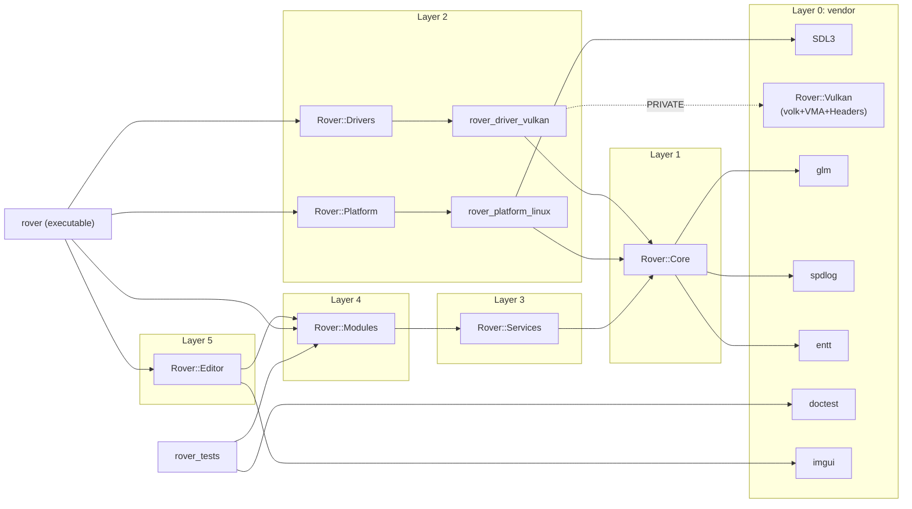

# 依赖管理规范

> 本规范定义 Rover 引擎对 **第三方依赖**（vendor）和 **内部模块依赖**的管理政策。当前依赖快照见 [`docs/dev/ARCHITECTURE.md`](../dev/ARCHITECTURE.md) §4。

---

## 1. vendor 政策

### 1.1 vendor 的角色

`vendor/` 是 **第三方依赖** 的唯一容纳处：

- 所有第三方库源码或 git submodule 都在 `vendor/<libname>/`
- 由 `vendor/CMakeLists.txt` 包装为 CMake target，对外暴露 `Rover::<Lib>` 别名（或库自身原生 target）
- 第一方代码 **绝不** 直接 add_subdirectory 到第三方库源码目录之外的位置

### 1.2 添加新依赖的流程（强制）

向 vendor 引入新库**必须**：

1. **写 ADR**：说明引入动机、考察过的替代方案、license 兼容性
2. **更新本文档**的"已使用依赖"清单
3. **更新 `vendor/CMakeLists.txt`**：包装为 target，定义编译宏
4. **决定集成方式**：
   - **首选** git submodule（清晰可追踪上游）
   - **次选** vendored 源码副本（如果库无 git 或上游不稳定）
   - **不选** `find_package`（要求开发者预装系统库，不可控）
5. **首选** header-only 或静态库；动态库仅在确实必要时考虑

### 1.3 修改 vendor 源码（强制禁止）

- ❌ **永远不要直接修改** `vendor/<lib>/` 内的源码
- ✅ 如需 patch：
  - 优先在 `vendor/CMakeLists.txt` 中通过 `target_compile_definitions` / `target_compile_options` 调整
  - 必要时写 wrapper（如 `vendor/<lib>_wrapper/`）封装一层
  - 极端情况下应 fork 并在文档中说明 fork 维护策略

### 1.4 升级第三方库

升级时：

1. 在分支上更新 submodule / 源码
2. 跑全套测试 + sanitizer
3. 更新 `docs/dev/<area>.md` 中的版本号
4. 写 commit message 标记升级原因（bug fix / 安全 / 新功能）

---

## 2. 当前 vendor 列表

| 库 | 版本 / 来源 | License | 用途 | 集成方式 |
|----|-----------|---------|------|---------|
| **SDL3** | submodule | Zlib | 窗口 / 输入 / 计时（platform 层） | submodule + CMake |
| **Vulkan-Headers** | submodule | Apache 2.0 | Vulkan API 头文件 | submodule + CMake |
| **volk** | submodule | MIT | Vulkan 函数指针动态加载 | submodule + CMake |
| **VulkanMemoryAllocator** | submodule | MIT | GPU 内存分配（VMA） | submodule + CMake (header-only) |
| **glm** | submodule | MIT | 数学（vector / matrix / quat） | submodule + CMake (header-only) |
| **EnTT** | submodule | MIT | ECS（用于 modules/scene） | submodule + CMake (header-only) |
| **spdlog** | submodule | MIT | 日志（core/log 封装） | submodule + CMake |
| **ImGui** | submodule | MIT | 编辑器 GUI（待 Phase 3） | submodule + CMake |
| **doctest** | submodule | MIT | 单元测试框架 | submodule + CMake (header-only) |

详见：[`vendor/CMakeLists.txt`](../../vendor/CMakeLists.txt)。

### 2.1 计划引入

| 库 | 用途 | Phase | License 待审 |
|----|------|-------|-------------|
| **tinygltf / cgltf** | GLTF 模型导入 | Phase 2 | MIT (tinygltf) / MIT (cgltf) |
| **stb_image** | 图片解码（PNG/JPG） | Phase 2 | MIT/Public Domain |
| **KTX-Software** | KTX2 纹理 | Phase 2 | Apache 2.0 |
| **Basis Universal** | KTX2 转码后端 | Phase 2 | Apache 2.0 |
| **miniaudio** 或 **OpenAL Soft** | 音频混音 | Phase 4 | MIT (miniaudio) / LGPL (OpenAL Soft) |
| **Jolt Physics** 或 **Bullet** | 物理 | Phase 4 | MIT (Jolt) / Zlib (Bullet) |
| **GLSL → 各后端 shader 转换器** | SPIRV-Cross / naga | Phase 6 | Apache 2.0 / MIT |

最终选型由 ADR 决定。

### 2.2 License 兼容性约束

Rover 自身计划开源（具体 license 待 v1.0 决定，候选 MIT / Apache 2.0 / BSD-3-Clause）。引入依赖必须：

- ✅ MIT / BSD / Zlib / Apache 2.0 / Public Domain：直接可用
- 🟡 LGPL：可链接（动态），需注意打包
- ❌ GPL：禁止（除非有特例豁免，且记录在 ADR）

---

## 3. CMake target 依赖图

### 3.1 顶层依赖



### 3.2 PUBLIC vs PRIVATE 规则

| 关系 | 链接类型 | 原因 |
|------|---------|------|
| `rover_core` → `spdlog` / `glm` / `entt` | PUBLIC | 模板 / inline 函数让头文件需要看到这些类型 |
| `rover_driver_vulkan` → `Rover::Vulkan` | **PRIVATE** | Vulkan 头文件不暴露给上层，否则会污染 services / modules |
| `rover_driver_vulkan` → `Rover::Core` | PUBLIC | 实现 `GraphicsDevice` 抽象需要其声明可见 |
| `rover_platform_linux` → `SDL3::SDL3` | **PRIVATE** | SDL 是平台细节，不暴露 |
| `rover_platform_linux` → `Vulkan::Headers` | **PRIVATE** | 仅 `SDL_Vulkan_CreateSurface` 内部使用 |
| `Rover::*`（聚合 façade） → 具体 target | INTERFACE | 聚合 target 自身无源码 |

**强制**：driver / platform 的第三方依赖一律 `PRIVATE`，不让 SDK 头文件透传到上层。

---

## 4. 模块依赖图（modules 内部）

```
modules/
├── scene/             基础（其他模块的世界容器）
├── animation/  ─────► scene
├── particle/   ─────► scene
├── ui/         ─────► （独立，依赖 services/graphics）
├── ai/         ─────► scene
└── serialization/─►  scene + 提供资产格式给所有模块
```

### 4.1 模块互依赖规则

- 默认模块互相 **不可依赖**（`modules/animation/` 不可 include `modules/particle/`）
- 例外：通过 `modules/<x>/CMakeLists.txt` 中显式声明依赖：
  ```cmake
  rover_add_library(rover_module_animation
      SOURCES ${_srcs}
      PUBLIC_DEPS Rover::Core Rover::Services
      PRIVATE_DEPS rover_module_scene   # 显式依赖 scene
      FOLDER "Rover/Modules"
  )
  ```
- 启用某模块时如果其依赖未启用应在 CMake 配置阶段报错

### 4.2 模块启停

| 模块 | 默认 | CMake 选项 | 依赖 |
|------|------|-----------|------|
| scene | ON | `ROVER_MODULE_SCENE` | — |
| animation | ON | `ROVER_MODULE_ANIMATION` | scene（计划） |
| particle | ON | `ROVER_MODULE_PARTICLE` | scene（计划） |
| ui | ON | `ROVER_MODULE_UI` | services/graphics |
| ai | ON | `ROVER_MODULE_AI` | scene |
| serialization | ON | `ROVER_MODULE_SERIALIZATION` | — |

---

## 5. 服务依赖

服务层（`services/`）之间的互访限制：

| 服务 | 可调用 |
|------|--------|
| GraphicsService | core/graphics 抽象 |
| PhysicsService | core 抽象 |
| AudioService | core 抽象 |
| NetworkService | core 抽象 |

**强制**：服务之间**不直接** include 对方头文件。如有跨服务通信需求，通过 `core/event/EventBus` 异步通信，或在 `main/` 中显式装配依赖（少数场景）。

---

## 6. 引入第三方库的决策矩阵

新库引入前回答以下问题：

1. **YAGNI 检查**：当前 phase 真的需要它吗？还是 phase+1 才用？
2. **替代方案**：标准库 / 已有依赖 / 自己写一小段 能解决吗？
3. **可移植性**：在所有目标平台（Linux/Windows/Mac/Android/iOS/Web）上可用吗？
4. **维护活跃度**：上游最近一年有提交吗？issue 响应及时吗？
5. **license 兼容**：是否落入 §2.2 的允许 license？
6. **二进制体积**：会增加多少二进制 / 编译时间？
7. **替换成本**：未来想换掉时，被多少代码 include？

任意一项答 "No / 不确定"，至少在 ADR 中明确说明。

---

## 7. 反例

```
❌ 在 services/graphics/CMakeLists.txt 中：
target_link_libraries(rover_services PUBLIC Rover::Vulkan)
   → 把 vulkan.h 拽到所有上层，违反抽象层

✅ 应该在 drivers/vulkan/CMakeLists.txt 中：
target_link_libraries(rover_driver_vulkan PRIVATE Rover::Vulkan)

❌ 直接 #include <vulkan/vulkan.h> 在 modules/scene/scene_tree.h
   → 模块层不应见 Vulkan，应通过 GraphicsService 抽象间接使用

❌ 引入 boost 单单为了 boost::optional
   → C++20 已有 std::optional，无需引入庞大的 boost

❌ 修改 vendor/SDL/src/video/x11/SDL_x11events.c 来"修复"一个 bug
   → 应当上游 PR；本地 patch 必须有 ADR + 文档说明

❌ 在 core/CMakeLists.txt 中 target_link_libraries(rover_core PUBLIC SDL3::SDL3)
   → core 不应依赖 SDL（SDL 是平台细节）
```

---

## 8. CI 检查（计划）

未来在 `misc/scripts/rover/commands/lint.py` 中加入：

- 检查 driver / platform target 是否所有第三方 deps 都是 PRIVATE
- 检查 services / modules 是否 include 了 driver / platform 头文件
- 检查 vendor/ 是否有未提交的本地修改

---

## 9. 参考

- [`docs/dev/ARCHITECTURE.md`](../dev/ARCHITECTURE.md) §4 CMake 目标依赖图
- [`docs/standard/ARCHITECTURE_RULES.md`](ARCHITECTURE_RULES.md) §6 CMake target 约束
- [`vendor/CMakeLists.txt`](../../vendor/CMakeLists.txt)
- [ADR-0001 三层倒置](../product/adr/ADR-0001-three-layer-architecture.md)
- [ADR-0002 单一 CMake 构建](../product/adr/ADR-0002-cmake-as-single-build-system.md)
